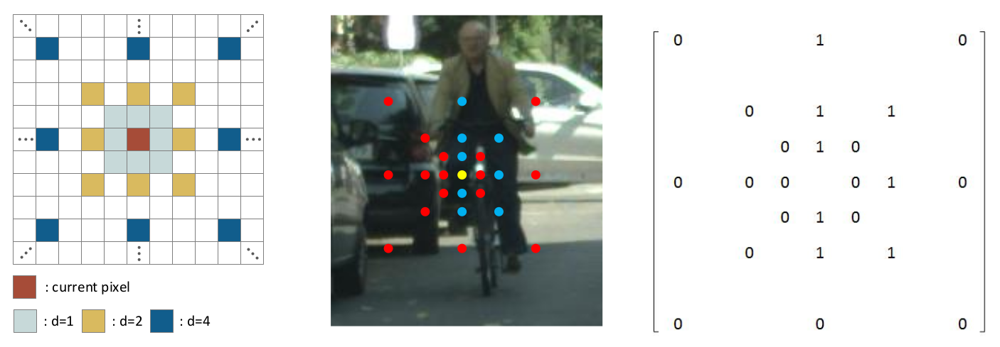
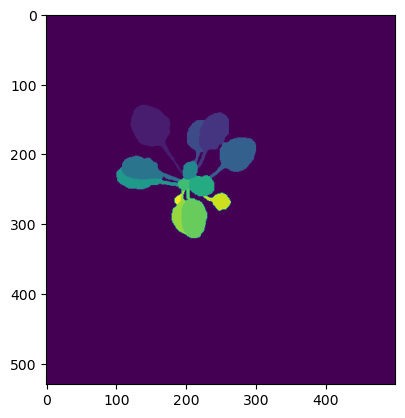
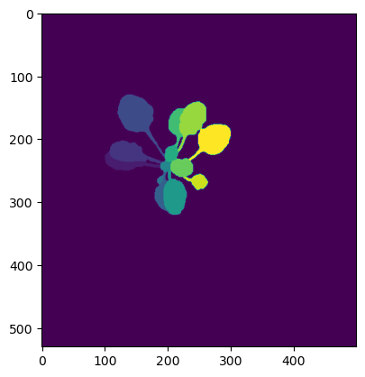
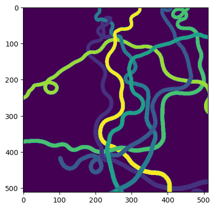
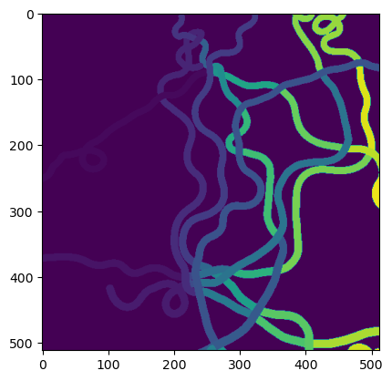
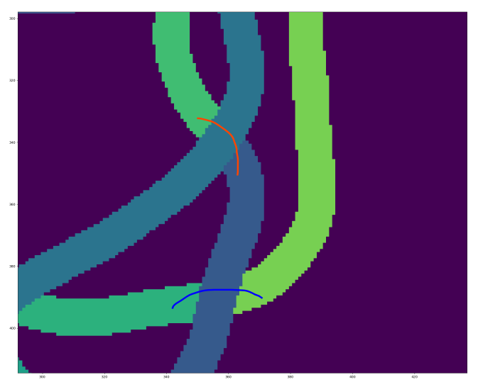

# Result Discussion

Use two types of neighborhoods / offsets:
1. Offset 1
```
offsets = [
    [0, -1, 0], [0, 0, -1],
    [0, -1, -1], [0, 1, 1], [0, -1, 1], [0, 1, -1],
    [0, -9, 0], [0, 0, -9],
    [0, -9, -9], [0, 9, -9], [0, -9, -4],
    [0, -4, -9], [0, 4, -9], [0, 9, -4],
    [0, -27, 0], [0, 0, -27], [0, -27, 27]
]
```
2. 4 neighborhoods at distance of {1, 2, 4, 8, 32, 64} (Similar to [Affinity Derivation and Graph Merge for Instance Segmentation](https://arxiv.org/abs/1811.10870)).
i.e.,

</img>

# 1. On CVPPP Plant dataset

<div style="float: left">
Input Image:

</img>
</div>

<div>
Output After Affinity and Mutex Watershed:

</img>
</div>

<p style="color: green">Note that the mutex watershed perfectly reconstructs the ground truth. </p>

# 2. On Cable dataset
<div style="float: left;">
Input Image:

</img>

</div>

<div>
Output After Affinity and Mutex Watershed:

</img>
</div>

<div style="font-size: 20px; margin-bottom: 200px">


<p style="color: red;">Disjoint parts of the same cable are not connected after mutex watershed even though the area of the kernel / neighborhood (64)
is larger than the width of a cable (10-15px).</p>


Zoomed-in view of the disconnected segments

</img>

<p> Why does this happen, and how to correct it? </p>

</div>


